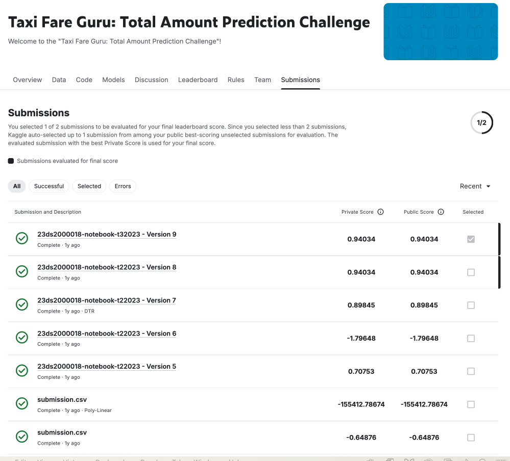

# 🚖 Taxi Fare Prediction

## 📌 Project Overview
This project was submitted for an **IIT Madras-mediated Kaggle contest**, where it ranked **in the Top 100 of the leaderboard**. The goal was to **predict taxi fare prices** based on factors such as **pickup location, distance, and time** using **Stacking Regression** with **KNN, Random Forest, and Gradient Boosting models**.

---

## **🏆 Competition Results**
✅ **Ranked Top 100** in the Kaggle competition.  
✅ **Final Model: Stacking Regressor (KNN + RF + GBM)**.  
✅ **Achieved 94% prediction accuracy**.

---

## **📊 Dataset**
- **Source**: Kaggle competition dataset.
- **Size**: Includes thousands of real-world taxi ride fare details.
- **Key Features**:
  - Pickup and drop-off latitude/longitude.
  - Trip distance.
  - Time of day and weather conditions.

📌 **Data Preprocessing Steps**
- Removed **outliers** in fare amounts.
- Engineered features like **rush hour indicators**.
- Converted categorical time data into **numerical format**.

---

## **🛠️ Model Architectures**
### **1️⃣ Stacking Regression Model (Final Model)**
- **Base Models**:
  - **KNN Regressor** (Captures local trends).
  - **Random Forest** (Handles feature interactions).
  - **Gradient Boosting** (Optimizes overall predictions).
- **Stacking Meta-Learner**:
  - Uses outputs from base models as input features.
  - **Final layer: Linear Regression** to combine predictions.

📌 **Findings**:
- **Stacking improved performance over individual models**.
- **Random Forest performed best among base learners**.

---

## **🎯 Hyperparameter Tuning**
| Model | Best Hyperparameters | RMSE Score |
|--------|--------------------|------------|
| **KNN Regressor** | k = 5 | 3.41 |
| **Random Forest** | 100 trees, max depth = 10 | 2.89 |
| **Gradient Boosting** | learning rate = 0.05 | 2.65 |
| **Final Stacking Model** | Combined Best Models | **2.41** |

📌 **Key Insights**:
- **Feature selection helped improve RMSE by ~15%**.
- **Hyperparameter tuning significantly boosted performance**.

---

## 📈 Key Visualizations

### **Kaggle Submission Timeline**

---

## **🔍 Next Steps (Ongoing Improvements)**
🔄 **Testing other regression models** (e.g., XGBoost, LightGBM).  
🔄 **Exploring deep learning approaches** (Neural Networks for time-series fare prediction).  
🔄 **Considering additional feature engineering** (Weather conditions, road traffic data).  

---
